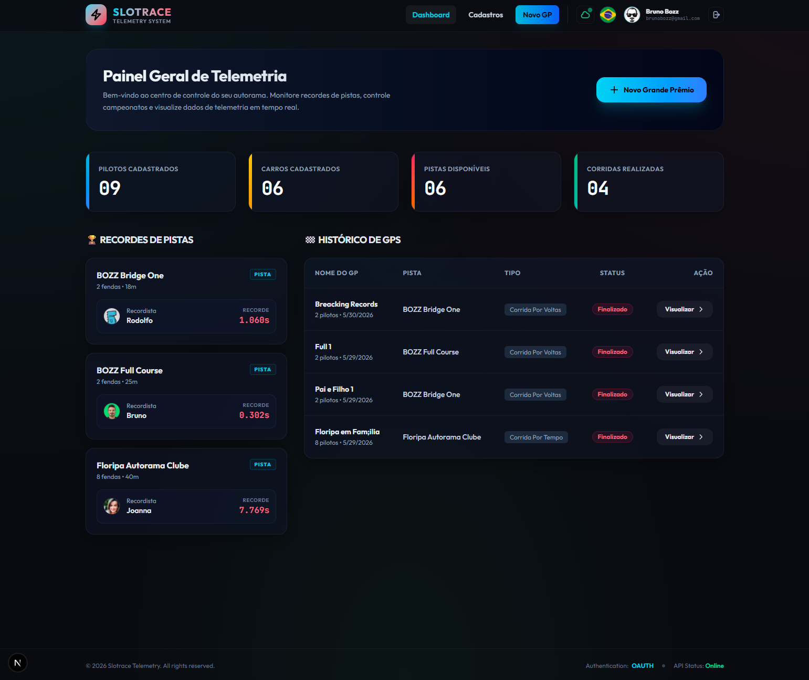
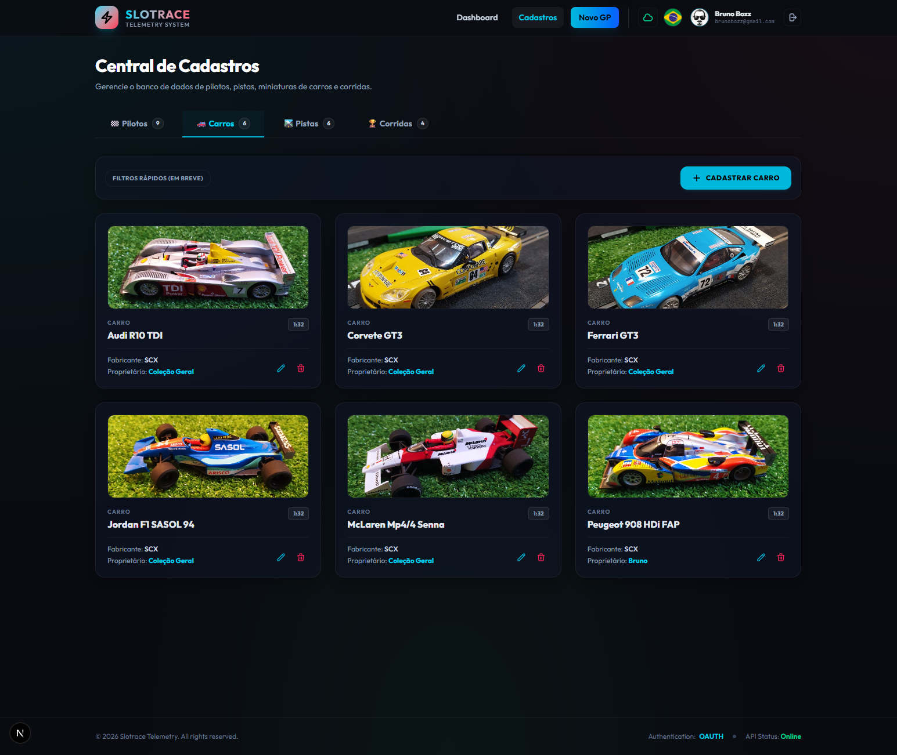
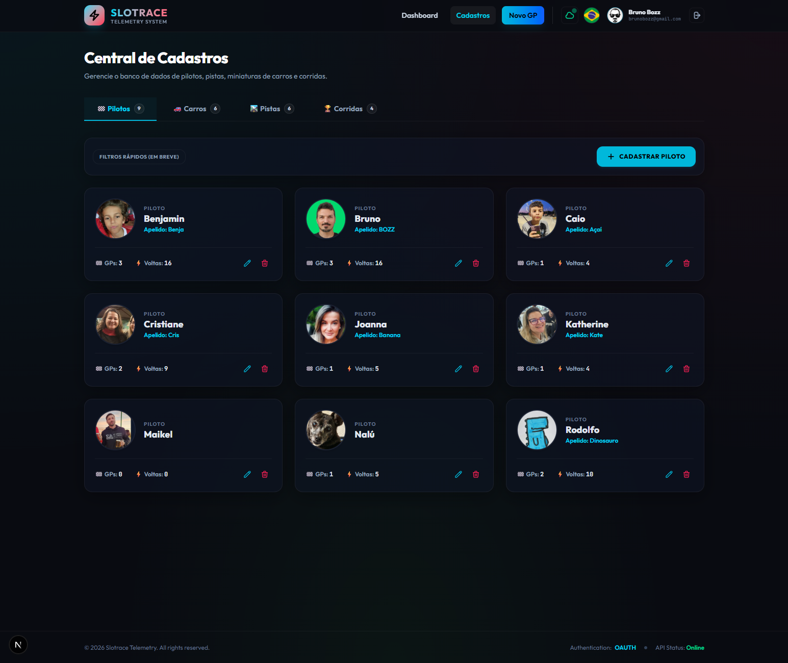
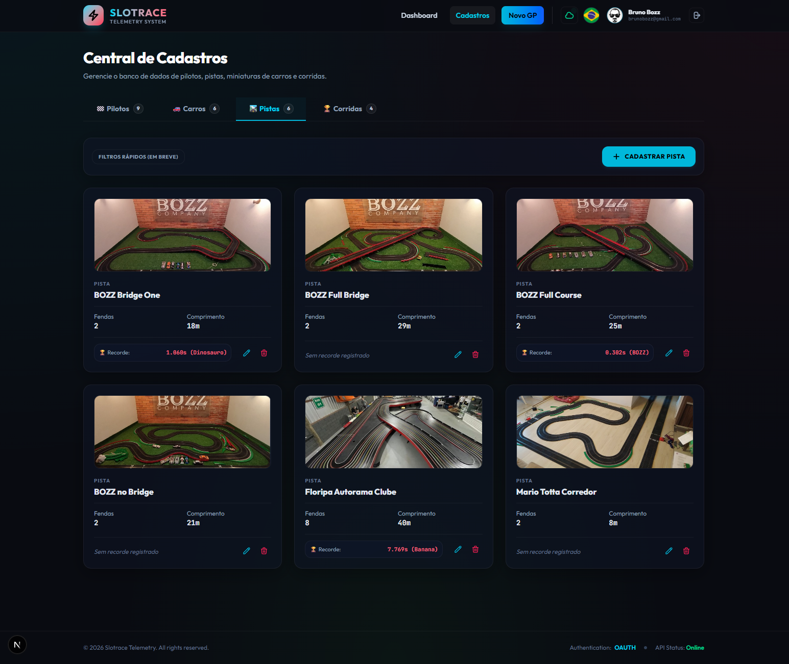
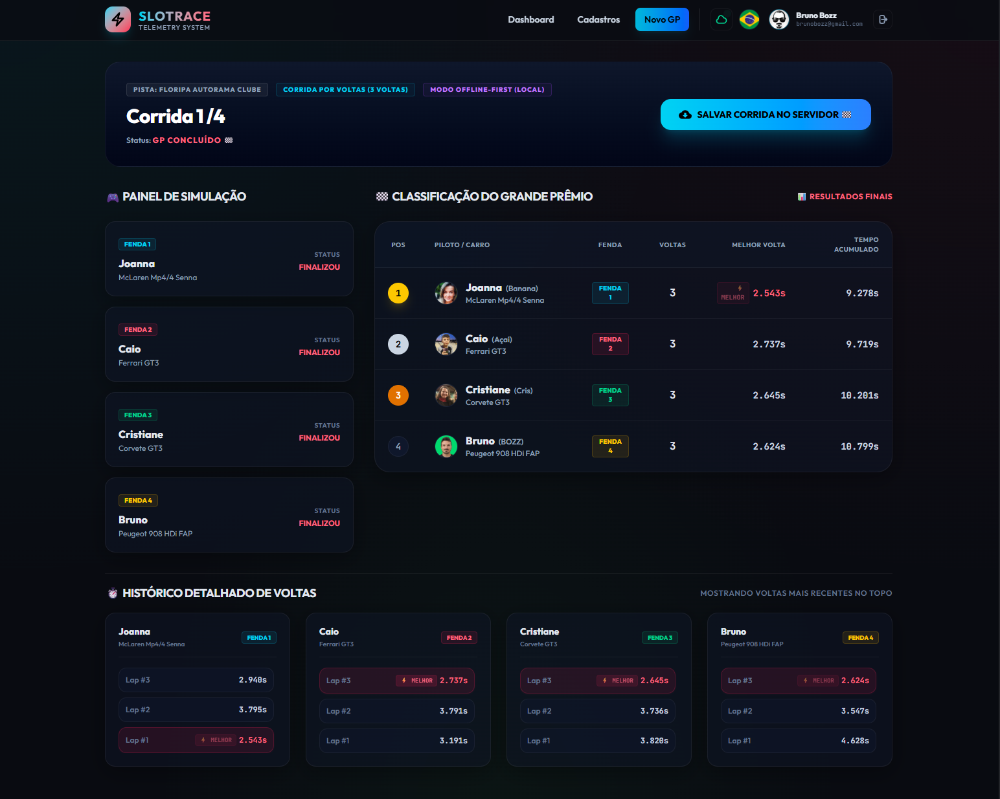

# ⚡ SLOTRACE Telemetry System

> **Slotrace** é um ecossistema completo e de alta performance de telemetria e gerenciamento para pistas de autorama (slot cars). Projetado com uma estética premium inspirada em painéis de eSports modernos, o sistema oferece telemetria em tempo real, cadastros visuais detalhados de pilotos, carros e pistas, controle preciso de recordes de tempos de volta e sincronização na nuvem via Google Drive.

---

## 🚀 Arquitetura e Tecnologias

O sistema é construído como um monorepo modular e responsivo:
* **Frontend**: Desenvolvido em **Next.js** (React) utilizando **Tailwind CSS v4** para estilização com técnicas modernas de Glassmorphism, garantindo transições extremamente rápidas e fluidas (150ms).
* **Backend**: APIs robustas em **Laravel** (PHP) para persistência segura dos dados locais ou em rede.
* **Internacionalização (i18n)**: Suporte dinâmico nativo para **Português (PT)**, **Inglês (EN)** e **Espanhol (ES)**.
* **Cloud Sync**: Sincronização automática direta com a conta de **Google Drive** do usuário, permitindo portabilidade 100% segura sem a necessidade de servidores complexos de terceiros.

---

## 🎨 Apresentação Visual & Telas do Sistema

Abaixo estão explicadas em detalhes as principais telas que compõem o ecossistema do **Slotrace**:

### 1. 📊 Painel Geral de Telemetria (Dashboard)



O **Dashboard** é a central de controle e o ponto de partida do Slotrace. Ele reúne de forma resumida e elegante todas as informações do seu autorama:
* **Cards de Métricas**: Quatro painéis superiores com efeitos luminosos premium destacam instantaneamente a quantidade de Pilotos, Carros, Pistas e Corridas realizadas no banco de dados.
* **🏆 Recordes de Pistas (Esquerda)**: Lista de forma dinâmica os melhores tempos e recordistas de cada circuito ativo no catálogo. Clicar em qualquer card de recorde redireciona o usuário diretamente à corrida histórica onde aquele recorde foi cravado.
* **🏁 Histórico de GPs (Direita)**: Uma tabela simplificada que exibe as últimas corridas realizadas, seu status atual (Finalizado, Em Progresso, Pausado) e botões rápidos para visualizar a telemetria detalhada ou retomar um GP pendente.

---

### 2. 🚗 Central de Cadastros - Galeria de Carros



Uma galeria interativa para catalogar e gerenciar a frota de bólidos em escala (ex: 1:32):
* **Fichas Técnicas Visuais**: Cada miniatura possui uma foto real do veículo, marca de fabricante (ex: SCX) e escala correspondente.
* **Vínculo de Proprietário**: Permite determinar se o carro pertence à Coleção Geral da pista ou se é propriedade privada de um piloto específico.
* **Ajuste de Imagem Integrado**: Integração com ferramenta interna de corte (cropper) para carregar imagens perfeitas dos carros de forma automatizada e leve.

---

### 3. 👥 Central de Cadastros - Grid de Pilotos



A tela onde os competidores são eternizados com avatares e estatísticas de carreira:
* **Cards Dinâmicos de Pilotos**: Apresenta foto ou avatar do piloto, nome completo e apelido oficial de corrida.
* **Estatísticas Cumulativas**: Exibe o total de Grandes Prêmios disputados e o número de voltas completadas ao longo de toda a carreira de forma automatizada.
* **Gerenciamento Completo**: Permite cadastrar novos pilotos ou editar os existentes de forma instantânea através de modais interativos.

---

### 4. 🛣️ Central de Cadastros - Catálogo de Pistas



O portfólio de circuitos ativos e disponíveis para novos Grandes Prêmios:
* **Layouts Reais**: Permite cadastrar fotos dos traçados reais do autorama ou designs de pistas.
* **Especificações Técnicas**: Detalha a quantidade de fendas (lanes) disponíveis no circuito e seu comprimento exato em metros.
* **Recorde Histórico Integrado**: O card exibe o menor tempo absoluto registrado na pista, destacando o piloto recordista (ex: `0.302s (BOZZ)` ou `1.060s (Dinossauro)`), incentivando a competição constante.

---

### 5. 🚦 Painel de Telemetria e Simulação em Tempo Real



A tela central onde a magia acontece. Trata-se do painel completo de corrida em tempo real:
* **Painel de Simulação (Esquerda)**: Permite registrar e acionar passagens de voltas em cada uma das fendas individualmente através de botões sensores, com tempos de precisão milimétrica.
* **Classificação do Grande Prêmio (Centro)**: Tabela atualizada dinamicamente exibindo a colocação atual dos pilotos, número de voltas concluídas, o tempo da **Melhor Volta** destacado com badge especial (`MELHOR`) e o tempo acumulado total.
* **⏱️ Histórico Detalhado de Voltas (Abaixo)**: Linhas do tempo individuais para cada fenda exibindo o histórico volta a volta de cada piloto com marcações de voltas rápidas para análise minuciosa de performance.
* **Modo Offline-First e Sincronização na Nuvem**: Uma barra de status superior mostra se o GP está sendo executado localmente. Ao final, com um único clique no botão **Salvar Corrida no Servidor**, todos os recordes globais e históricos de voltas são consolidados.

---

## 🛠️ Como Iniciar o Projeto

### Pré-requisitos
* PHP >= 8.2 e Composer (para o backend Laravel)
* Node.js >= 18 e npm (para o frontend Next.js)

### 1. Inicializando o Backend (Laravel)
1. Navegue para a pasta `backend/`:
   ```bash
   cd backend
   ```
2. Instale as dependências:
   ```bash
   composer install
   ```
3. Configure o arquivo `.env` (você pode copiar o `.env.example`):
   ```bash
   copy .env.example .env
   ```
4. Gere a chave da aplicação e rode as migrações do banco de dados (SQLite por padrão):
   ```bash
   php artisan key:generate
   php artisan migrate --seed
   ```
5. Inicie o servidor local:
   ```bash
   php artisan serve --port=8000
   ```

### 2. Inicializando o Frontend (Next.js)
1. Navegue para a pasta `frontend/`:
   ```bash
   cd ../frontend
   ```
2. Instale as dependências com npm:
   ```bash
   npm install
   ```
3. Inicie o servidor de desenvolvimento:
   ```bash
   npm run dev
   ```
4. Acesse em seu navegador: [http://localhost:3000](http://localhost:3000) (ou a porta indicada pelo seu Next.js).

---

## ☁️ Backup & Sincronização no Google Drive
O Slotrace possui um backup baseado em **Google Drive Sync**. Ao conectar sua conta do Google Drive na barra superior, o sistema cria automaticamente um arquivo persistente na sua nuvem particular. Isso garante que:
* Seus dados de pilotos, carros, recordes e pistas nunca sejam perdidos.
* Você possa rodar a aplicação localmente em diferentes computadores (como no autorama e no seu computador pessoal) e manter tudo perfeitamente sincronizado com um clique.

---

*Desenvolvido com carinho para entusiastas do Slot Car e Telemetria de Precisão. 🏁🚗⚡*
